# Use Case Diagram - Hệ Thống Quản Lý Sinh Viên VLU

## 1. Sơ Đồ Use Case Tổng Quan

```mermaid
graph TB
    subgraph "Actors"
        Admin[👤 Admin]
        Teacher[👨‍🏫 Teacher]
        Student[👨‍🎓 Student]
        User[👤 User<br/>Chung]
    end

    subgraph "Authentication & Profile Management"
        UC1[Đăng ký tài khoản]
        UC2[Đăng nhập]
        UC3[Xem thông tin cá nhân]
        UC4[Cập nhật thông tin cá nhân]
        UC5[Đổi mật khẩu]
    end

    subgraph "Student Management"
        UC6[Tạo sinh viên]
        UC7[Xem danh sách sinh viên]
        UC8[Xem chi tiết sinh viên]
        UC9[Cập nhật thông tin sinh viên]
        UC10[Xóa sinh viên]
        UC11[Xem đội nhóm của sinh viên]
        UC12[Xem dự án của sinh viên]
        UC13[Xem thống kê sinh viên]
    end

    subgraph "Teacher Management"
        UC14[Tạo giáo viên]
        UC15[Xem danh sách giáo viên]
        UC16[Xem chi tiết giáo viên]
        UC17[Cập nhật thông tin giáo viên]
        UC18[Xóa giáo viên]
        UC19[Xem dự án của giáo viên]
        UC20[Xem đánh giá của giáo viên]
        UC21[Xem thống kê giáo viên]
    end

    subgraph "Project Management"
        UC22[Tạo dự án]
        UC23[Xem danh sách dự án]
        UC24[Xem chi tiết dự án]
        UC25[Cập nhật dự án]
        UC26[Xóa dự án]
        UC27[Xem đội nhóm của dự án]
        UC28[Upload tài liệu dự án]
        UC29[Xem tài liệu dự án]
        UC30[Xem thống kê dự án]
    end

    subgraph "Team Management"
        UC31[Tạo đội nhóm]
        UC32[Xem danh sách đội nhóm]
        UC33[Xem chi tiết đội nhóm]
        UC34[Cập nhật đội nhóm]
        UC35[Xóa đội nhóm]
        UC36[Thêm thành viên vào đội]
        UC37[Xóa thành viên khỏi đội]
        UC38[Thay đổi vai trò thành viên]
    end

    subgraph "Submission Management"
        UC39[Tạo bài nộp]
        UC40[Xem danh sách bài nộp]
        UC41[Xem chi tiết bài nộp]
        UC42[Cập nhật bài nộp]
        UC43[Xóa bài nộp]
        UC44[Nộp bài]
        UC45[Đánh giá bài nộp]
    end

    subgraph "Evaluation Management"
        UC46[Tạo đánh giá]
        UC47[Xem danh sách đánh giá]
        UC48[Xem chi tiết đánh giá]
        UC49[Cập nhật đánh giá]
        UC50[Xóa đánh giá]
    end

    subgraph "Admin Management"
        UC51[Quản lý người dùng]
        UC52[Kích hoạt/Vô hiệu hóa người dùng]
        UC53[Thay đổi vai trò người dùng]
        UC54[Xóa người dùng]
        UC55[Xem thống kê hệ thống]
        UC56[Xem metrics hệ thống]
        UC57[Seed dữ liệu mẫu]
    end

    subgraph "Monitoring"
        UC58[Gửi heartbeat]
    end

    %% User connections
    User --> UC1
    User --> UC2
    User --> UC3
    User --> UC4
    User --> UC5

    %% Student connections
    Student --> UC23
    Student --> UC24
    Student --> UC32
    Student --> UC33
    Student --> UC31
    Student --> UC36
    Student --> UC37
    Student --> UC39
    Student --> UC40
    Student --> UC41
    Student --> UC42
    Student --> UC43
    Student --> UC44
    Student --> UC47
    Student --> UC48
    Student --> UC11
    Student --> UC12
    Student --> UC58

    %% Teacher connections
    Teacher --> UC14
    Teacher --> UC15
    Teacher --> UC16
    Teacher --> UC17
    Teacher --> UC22
    Teacher --> UC23
    Teacher --> UC24
    Teacher --> UC25
    Teacher --> UC28
    Teacher --> UC29
    Teacher --> UC30
    Teacher --> UC19
    Teacher --> UC20
    Teacher --> UC21
    Teacher --> UC40
    Teacher --> UC41
    Teacher --> UC45
    Teacher --> UC46
    Teacher --> UC47
    Teacher --> UC48
    Teacher --> UC49
    Teacher --> UC32
    Teacher --> UC33
    Teacher --> UC35
    Teacher --> UC58

    %% Admin connections
    Admin --> UC6
    Admin --> UC7
    Admin --> UC8
    Admin --> UC9
    Admin --> UC10
    Admin --> UC13
    Admin --> UC14
    Admin --> UC15
    Admin --> UC16
    Admin --> UC17
    Admin --> UC18
    Admin --> UC21
    Admin --> UC22
    Admin --> UC23
    Admin --> UC24
    Admin --> UC25
    Admin --> UC26
    Admin --> UC30
    Admin --> UC35
    Admin --> UC50
    Admin --> UC51
    Admin --> UC52
    Admin --> UC53
    Admin --> UC54
    Admin --> UC55
    Admin --> UC56
    Admin --> UC57
    Admin --> UC58

    style Admin fill:#ff6b6b
    style Teacher fill:#4ecdc4
    style Student fill:#95e1d3
    style User fill:#fce38a
```



## 2. Chi Tiết Tương Tác Của Các Thực Thể

### 2.1. Thực Thể User (Người Dùng)

**Mô tả**: Thực thể cơ bản đại diện cho tất cả người dùng trong hệ thống.

**Thuộc tính chính**:
- `id`: Định danh duy nhất
- `username`: Tên đăng nhập
- `email`: Email
- `password_hash`: Mật khẩu đã mã hóa
- `role`: Vai trò (student, teacher, admin)
- `is_active`: Trạng thái hoạt động

**Tương tác**:
- **Quan hệ 1-1 với Student**: Một User có thể có một Student profile
- **Quan hệ 1-1 với Teacher**: Một User có thể có một Teacher profile
- **Quản lý bởi Admin**: Admin có thể tạo, xóa, kích hoạt/vô hiệu hóa User

**Use Cases**:
- Đăng ký tài khoản (UC1)
- Đăng nhập (UC2)
- Xem/Cập nhật thông tin cá nhân (UC3, UC4)
- Đổi mật khẩu (UC5)

---

### 2.2. Thực Thể Student (Sinh Viên)

**Mô tả**: Thực thể đại diện cho sinh viên trong hệ thống.

**Thuộc tính chính**:
- `student_code`: Mã sinh viên
- `full_name`: Họ và tên
- `major`: Chuyên ngành
- `class_name`: Lớp
- `gpa`: Điểm trung bình
- `status`: Trạng thái (active, inactive, graduated, suspended)

**Tương tác**:
- **Quan hệ N-N với Team** (qua TeamMember): Sinh viên có thể tham gia nhiều đội
- **Quan hệ 1-N với ProjectSubmission**: Sinh viên có thể nộp nhiều bài
- **Quan hệ 1-N với ProjectEvaluation**: Sinh viên có thể đánh giá nhiều dự án
- **Quản lý bởi Admin**: Admin tạo, cập nhật, xóa sinh viên

**Use Cases**:
- Xem danh sách dự án (UC23, UC24)
- Tạo/Quản lý đội nhóm (UC31, UC36, UC37)
- Tạo/Cập nhật bài nộp (UC39, UC42, UC44)
- Xem đánh giá (UC47, UC48)
- Xem thông tin đội nhóm và dự án của mình (UC11, UC12)

---

### 2.3. Thực Thể Teacher (Giáo Viên)

**Mô tả**: Thực thể đại diện cho giáo viên/hướng dẫn trong hệ thống.

**Thuộc tính chính**:
- `teacher_code`: Mã giáo viên
- `full_name`: Họ và tên
- `department`: Khoa/Bộ môn
- `title`: Chức danh
- `specialization`: Chuyên môn
- `status`: Trạng thái (active, inactive, retired)

**Tương tác**:
- **Quan hệ 1-N với Project**: Giáo viên có thể tạo và quản lý nhiều dự án
- **Quan hệ 1-N với ProjectEvaluation**: Giáo viên có thể đánh giá nhiều bài nộp
- **Quản lý bởi Admin**: Admin tạo, cập nhật, xóa giáo viên

**Use Cases**:
- Tạo/Quản lý dự án (UC22, UC25, UC28, UC29)
- Đánh giá bài nộp (UC45, UC46, UC49)
- Xem thống kê dự án và đánh giá (UC19, UC20, UC21, UC30)
- Quản lý đội nhóm (UC32, UC33, UC35)

---

### 2.4. Thực Thể Project (Dự Án)

**Mô tả**: Thực thể đại diện cho các dự án được giao cho sinh viên.

**Thuộc tính chính**:
- `project_code`: Mã dự án
- `title`: Tiêu đề
- `description`: Mô tả
- `requirements`: Yêu cầu
- `difficulty_level`: Độ khó (beginner, intermediate, advanced)
- `max_team_size`, `min_team_size`: Số lượng thành viên
- `status`: Trạng thái (draft, published, in_progress, completed, cancelled)
- `deadline`: Hạn nộp

**Tương tác**:
- **Quan hệ N-1 với Teacher**: Mỗi dự án có một giáo viên hướng dẫn
- **Quan hệ 1-N với Team**: Một dự án có thể có nhiều đội tham gia
- **Quan hệ 1-N với ProjectSubmission**: Một dự án có nhiều bài nộp
- **Quan hệ 1-N với ProjectEvaluation**: Một dự án có nhiều đánh giá
- **Quan hệ 1-N với ProjectDocument**: Một dự án có nhiều tài liệu

**Use Cases**:
- Tạo/Cập nhật/Xóa dự án (UC22, UC25, UC26) - Teacher/Admin
- Xem danh sách/Chi tiết dự án (UC23, UC24) - Tất cả
- Upload/Xem tài liệu (UC28, UC29) - Teacher/Student
- Xem đội nhóm tham gia (UC27) - Tất cả

---

### 2.5. Thực Thể Team (Đội Nhóm)

**Mô tả**: Thực thể đại diện cho các đội nhóm tham gia dự án.

**Thuộc tính chính**:
- `team_name`: Tên đội
- `leader_id`: ID trưởng nhóm
- `status`: Trạng thái (forming, active, completed, disbanded)
- `formed_at`: Ngày thành lập
- `completed_at`: Ngày hoàn thành

**Tương tác**:
- **Quan hệ N-1 với Project**: Mỗi đội thuộc về một dự án
- **Quan hệ N-1 với Student**: Mỗi đội có một trưởng nhóm (leader)
- **Quan hệ 1-N với TeamMember**: Một đội có nhiều thành viên
- **Quan hệ 1-N với ProjectSubmission**: Một đội có thể nộp nhiều bài

**Use Cases**:
- Tạo đội nhóm (UC31) - Student
- Thêm/Xóa thành viên (UC36, UC37) - Student/Leader
- Thay đổi vai trò (UC38) - Leader
- Xem danh sách/Chi tiết đội (UC32, UC33) - Tất cả
- Xóa đội (UC35) - Teacher/Admin

---

### 2.6. Thực Thể TeamMember (Thành Viên Đội)

**Mô tả**: Thực thể liên kết giữa Student và Team.

**Thuộc tính chính**:
- `role`: Vai trò (leader, member)
- `status`: Trạng thái (active, left)
- `joined_at`: Ngày tham gia
- `left_at`: Ngày rời đội

**Tương tác**:
- **Quan hệ N-1 với Team**: Một thành viên thuộc về một đội
- **Quan hệ N-1 với Student**: Một thành viên là một sinh viên

**Ràng buộc**:
- Một sinh viên không thể tham gia nhiều đội trong cùng một dự án (unique constraint)
- Mỗi đội chỉ có một leader

---

### 2.7. Thực Thể ProjectSubmission (Bài Nộp)

**Mô tả**: Thực thể đại diện cho các bài nộp của sinh viên/đội.

**Thuộc tính chính**:
- `submission_type`: Loại (individual, team)
- `title`: Tiêu đề
- `file_path`: Đường dẫn file
- `submission_category`: Loại bài nộp (proposal, progress, final, presentation, other)
- `status`: Trạng thái (draft, submitted, under_review, approved, rejected, revision_required)
- `version`: Phiên bản
- `feedback`: Phản hồi từ giáo viên

**Tương tác**:
- **Quan hệ N-1 với Project**: Mỗi bài nộp thuộc về một dự án
- **Quan hệ N-1 với Team**: Bài nộp có thể thuộc về một đội (nếu là team submission)
- **Quan hệ N-1 với Student**: Bài nộp có thể thuộc về một sinh viên (nếu là individual submission)
- **Quan hệ 1-N với ProjectEvaluation**: Một bài nộp có thể có nhiều đánh giá

**Use Cases**:
- Tạo/Cập nhật/Xóa bài nộp (UC39, UC42, UC43) - Student
- Nộp bài (UC44) - Student
- Đánh giá bài nộp (UC45) - Teacher
- Xem danh sách/Chi tiết (UC40, UC41) - Tất cả

---

### 2.8. Thực Thể ProjectEvaluation (Đánh Giá)

**Mô tả**: Thực thể đại diện cho đánh giá của giáo viên hoặc sinh viên.

**Thuộc tính chính**:
- `evaluator_type`: Loại người đánh giá (teacher, student)
- `technical_quality`: Điểm chất lượng kỹ thuật (1-10)
- `creativity`: Điểm sáng tạo (1-10)
- `presentation`: Điểm trình bày (1-10)
- `teamwork`: Điểm làm việc nhóm (1-10)
- `timeliness`: Điểm đúng hạn (1-10)
- `documentation`: Điểm tài liệu (1-10)
- `total_score`: Tổng điểm
- `percentage`: Phần trăm
- `recommendation`: Đánh giá tổng thể (excellent, good, satisfactory, needs_improvement, poor)

**Tương tác**:
- **Quan hệ N-1 với Project**: Mỗi đánh giá thuộc về một dự án
- **Quan hệ N-1 với ProjectSubmission**: Mỗi đánh giá cho một bài nộp
- **Quan hệ N-1 với Teacher**: Đánh giá có thể được tạo bởi giáo viên
- **Quan hệ N-1 với Student**: Đánh giá có thể được tạo bởi sinh viên (peer review)

**Use Cases**:
- Tạo/Cập nhật/Xóa đánh giá (UC46, UC49, UC50) - Teacher/Student/Admin
- Xem danh sách/Chi tiết đánh giá (UC47, UC48) - Tất cả

---

### 2.9. Thực Thể ProjectDocument (Tài Liệu Dự Án)

**Mô tả**: Thực thể đại diện cho các tài liệu liên quan đến dự án.

**Thuộc tính chính**:
- `title`: Tiêu đề tài liệu
- `file_path`: Đường dẫn file
- `file_type`: Loại file
- `file_size`: Kích thước file
- `document_type`: Loại tài liệu (requirement, design, implementation, report, other)
- `uploaded_by`: Người upload

**Tương tác**:
- **Quan hệ N-1 với Project**: Mỗi tài liệu thuộc về một dự án
- **Quan hệ N-1 với User**: Mỗi tài liệu được upload bởi một người dùng

**Use Cases**:
- Upload tài liệu (UC28) - Teacher/Student
- Xem tài liệu (UC29) - Tất cả

---

## 3. Đánh Giá Tương Tác Hiện Tại

### 3.1. Điểm Mạnh

✅ **Phân quyền rõ ràng**: Hệ thống có phân quyền tốt với Admin, Teacher, Student

✅ **Quan hệ đầy đủ**: Các thực thể có quan hệ rõ ràng và hợp lý

✅ **Quản lý đội nhóm**: Hỗ trợ cả submission cá nhân và nhóm

✅ **Đánh giá đa chiều**: Hỗ trợ đánh giá từ cả giáo viên và sinh viên (peer review)

✅ **Quản lý tài liệu**: Có hệ thống quản lý tài liệu cho dự án

### 3.2. Vấn Đề Phát Hiện

#### ❌ **Vấn đề 1: Thiếu quản lý đăng ký dự án**
- **Hiện tại**: Sinh viên có thể tự tạo đội và tham gia dự án bất kỳ
- **Vấn đề**: Không có cơ chế đăng ký/chấp nhận tham gia dự án
- **Hậu quả**: Khó kiểm soát số lượng đội tham gia, không có quy trình phê duyệt

#### ❌ **Vấn đề 2: Thiếu quản lý yêu cầu tham gia đội**
- **Hiện tại**: Chỉ có thêm thành viên trực tiếp
- **Vấn đề**: Không có cơ chế sinh viên gửi yêu cầu tham gia đội
- **Hậu quả**: Thiếu tính tương tác, khó tìm đội

#### ❌ **Vấn đề 3: Thiếu thông báo và cập nhật trạng thái**
- **Hiện tại**: Không có hệ thống thông báo
- **Vấn đề**: Sinh viên/giáo viên không được thông báo khi có cập nhật
- **Hậu quả**: Thiếu tính tương tác, khó theo dõi tiến độ

#### ❌ **Vấn đề 4: Thiếu quản lý deadline và nhắc nhở**
- **Hiện tại**: Chỉ có trường deadline trong Project
- **Vấn đề**: Không có hệ thống nhắc nhở, không có deadline cho từng milestone
- **Hậu quả**: Sinh viên dễ quên deadline

#### ❌ **Vấn đề 5: Thiếu quản lý tiến độ dự án**
- **Hiện tại**: Chỉ có status đơn giản
- **Vấn đề**: Không có milestone, không theo dõi tiến độ chi tiết
- **Hậu quả**: Khó đánh giá tiến độ thực tế

#### ❌ **Vấn đề 6: Thiếu quản lý phản hồi và thảo luận**
- **Hiện tại**: Chỉ có feedback trong submission
- **Vấn đề**: Không có hệ thống comment, thảo luận
- **Hậu quả**: Khó trao đổi giữa giáo viên và sinh viên

#### ❌ **Vấn đề 7: Thiếu quản lý lịch sử thay đổi**
- **Hiện tại**: Chỉ có version trong submission
- **Vấn đề**: Không có audit log, không theo dõi lịch sử thay đổi
- **Hậu quả**: Khó truy vết, khó debug

#### ❌ **Vấn đề 8: Thiếu validation và ràng buộc nghiệp vụ**
- **Hiện tại**: Một số validation cơ bản
- **Vấn đề**: 
  - Không kiểm tra sinh viên đã tham gia đội khác trong cùng dự án chưa (có unique constraint nhưng chưa đủ)
  - Không kiểm tra deadline khi nộp bài
  - Không kiểm tra số lượng đội tối đa cho mỗi dự án

#### ❌ **Vấn đề 9: Thiếu quản lý điểm số và báo cáo**
- **Hiện tại**: Có evaluation nhưng chưa có tổng hợp điểm
- **Vấn đề**: Không có báo cáo tổng hợp điểm số, không có ranking
- **Hậu quả**: Khó đánh giá tổng thể

#### ❌ **Vấn đề 10: Thiếu quản lý tài nguyên và file**
- **Hiện tại**: Chỉ lưu file_path
- **Vấn đề**: Không có quản lý storage, không có validation file type/size
- **Hậu quả**: Dễ lỗi, khó quản lý

---

## 4. Đề Xuất Tối Ưu Hóa

### 4.1. Thêm Thực Thể Mới

#### 📋 **ProjectRegistration (Đăng Ký Dự Án)**
```python
- id
- project_id
- team_id
- status: pending, approved, rejected
- registered_at
- approved_at
- rejected_at
- rejection_reason
```

**Use Cases mới**:
- UC59: Đăng ký tham gia dự án (Student/Team)
- UC60: Phê duyệt/Từ chối đăng ký (Teacher)
- UC61: Xem danh sách đăng ký (Teacher/Admin)

#### 📋 **TeamInvitation (Lời Mời Tham Gia Đội)**
```python
- id
- team_id
- student_id
- inviter_id (student who sent invitation)
- status: pending, accepted, rejected
- invited_at
- responded_at
```

**Use Cases mới**:
- UC62: Gửi lời mời tham gia đội (Student/Leader)
- UC63: Chấp nhận/Từ chối lời mời (Student)
- UC64: Xem lời mời đã gửi/nhận (Student)

#### 📋 **Notification (Thông Báo)**
```python
- id
- user_id
- type: submission_reviewed, team_invitation, project_approved, deadline_reminder, etc.
- title
- message
- related_entity_type: project, team, submission, etc.
- related_entity_id
- is_read: boolean
- created_at
```

**Use Cases mới**:
- UC65: Xem thông báo (Tất cả)
- UC66: Đánh dấu đã đọc (Tất cả)
- UC67: Xóa thông báo (Tất cả)

#### 📋 **ProjectMilestone (Milestone Dự Án)**
```python
- id
- project_id
- title
- description
- deadline
- status: not_started, in_progress, completed
- completed_at
```

**Use Cases mới**:
- UC68: Tạo milestone (Teacher)
- UC69: Cập nhật trạng thái milestone (Teacher/Student)
- UC70: Xem milestone (Tất cả)

#### 📋 **Comment (Bình Luận)**
```python
- id
- entity_type: project, submission, evaluation
- entity_id
- user_id
- content
- parent_comment_id (for nested comments)
- created_at
- updated_at
```

**Use Cases mới**:
- UC71: Thêm bình luận (Tất cả)
- UC72: Trả lời bình luận (Tất cả)
- UC73: Xóa bình luận (Tác giả/Admin)

#### 📋 **ActivityLog (Nhật Ký Hoạt Động)**
```python
- id
- user_id
- action_type: create, update, delete, submit, review, etc.
- entity_type
- entity_id
- old_values (JSON)
- new_values (JSON)
- ip_address
- created_at
```

**Use Cases mới**:
- UC74: Xem nhật ký hoạt động (Admin)
- UC75: Xem lịch sử thay đổi (Admin/Teacher)

### 4.2. Cải Thiện Thực Thể Hiện Có

#### 🔧 **Project - Thêm trường**:
```python
- max_teams: Số lượng đội tối đa
- registration_deadline: Hạn đăng ký
- auto_approve: Tự động phê duyệt đăng ký
```

#### 🔧 **Team - Thêm trường**:
```python
- description: Mô tả đội
- skills_required: Kỹ năng yêu cầu
- is_open: Độ mở (có chấp nhận thành viên mới không)
```

#### 🔧 **ProjectSubmission - Cải thiện**:
```python
- milestone_id: Liên kết với milestone
- submission_deadline: Deadline cụ thể cho submission này
- late_submission: Có nộp muộn không
```

#### 🔧 **ProjectEvaluation - Cải thiện**:
```python
- evaluation_criteria_id: Tiêu chí đánh giá (có thể tùy chỉnh)
- weighted_scores: Điểm có trọng số
```

### 4.3. Cải Thiện Use Cases Hiện Có

#### 🔄 **UC31 - Tạo đội nhóm**:
- **Thêm**: Kiểm tra số lượng đội tối đa của dự án
- **Thêm**: Tự động đăng ký dự án khi tạo đội

#### 🔄 **UC39 - Tạo bài nộp**:
- **Thêm**: Kiểm tra deadline
- **Thêm**: Tự động gửi thông báo cho giáo viên
- **Thêm**: Validation file type và size

#### 🔄 **UC45 - Đánh giá bài nộp**:
- **Thêm**: Tự động gửi thông báo cho sinh viên
- **Thêm**: Tính toán điểm trung bình nếu có nhiều đánh giá

#### 🔄 **UC22 - Tạo dự án**:
- **Thêm**: Tự động tạo các milestone mặc định
- **Thêm**: Thiết lập deadline reminders

### 4.4. Thêm Business Rules

#### 📐 **Rule 1: Giới hạn số lượng đội**
- Mỗi dự án chỉ cho phép tối đa `max_teams` đội tham gia
- Khi đạt giới hạn, không cho phép đăng ký mới

#### 📐 **Rule 2: Deadline validation**
- Không cho phép nộp bài sau deadline (trừ khi giáo viên cho phép)
- Tự động đánh dấu `late_submission = true` nếu nộp muộn

#### 📐 **Rule 3: Team size validation**
- Khi thêm thành viên, kiểm tra `min_team_size` và `max_team_size`
- Không cho phép đội có ít hơn `min_team_size` thành viên khi bắt đầu dự án

#### 📐 **Rule 4: Submission workflow**
- Draft → Submitted (sinh viên nộp)
- Submitted → Under Review (tự động khi nộp)
- Under Review → Approved/Rejected/Revision Required (giáo viên đánh giá)
- Revision Required → Draft (sinh viên chỉnh sửa)

#### 📐 **Rule 5: Evaluation rules**
- Mỗi submission chỉ có thể có 1 đánh giá từ giáo viên hướng dẫn
- Có thể có nhiều đánh giá từ sinh viên (peer review)
- Điểm cuối cùng = (Điểm giáo viên * 0.7) + (Điểm trung bình peer review * 0.3)

### 4.5. Cải Thiện API Endpoints

#### 🚀 **Thêm endpoints mới**:

```
POST   /api/projects/{id}/register          - Đăng ký tham gia dự án
GET    /api/projects/{id}/registrations     - Xem danh sách đăng ký
PUT    /api/registrations/{id}/approve      - Phê duyệt đăng ký
PUT    /api/registrations/{id}/reject       - Từ chối đăng ký

POST   /api/teams/{id}/invite               - Gửi lời mời tham gia đội
GET    /api/teams/invitations               - Xem lời mời
PUT    /api/invitations/{id}/accept         - Chấp nhận lời mời
PUT    /api/invitations/{id}/reject         - Từ chối lời mời

GET    /api/notifications                   - Xem thông báo
PUT    /api/notifications/{id}/read         - Đánh dấu đã đọc
DELETE /api/notifications/{id}              - Xóa thông báo

GET    /api/projects/{id}/milestones        - Xem milestone
POST   /api/projects/{id}/milestones        - Tạo milestone
PUT    /api/milestones/{id}                 - Cập nhật milestone

POST   /api/comments                        - Thêm bình luận
GET    /api/comments                        - Xem bình luận
DELETE /api/comments/{id}                   - Xóa bình luận

GET    /api/admin/activity-logs             - Xem nhật ký hoạt động
GET    /api/entities/{type}/{id}/history    - Xem lịch sử thay đổi
```

---

## 5. Sơ Đồ Use Case Sau Khi Tối Ưu

```mermaid
graph TB
    subgraph "Enhanced Actors"
        Admin[👤 Admin]
        Teacher[👨‍🏫 Teacher]
        Student[👨‍🎓 Student]
    end

    subgraph "Enhanced Project Management"
        UC22[Tạo dự án]
        UC23[Xem danh sách dự án]
        UC59[Đăng ký tham gia dự án]
        UC60[Phê duyệt/Từ chối đăng ký]
        UC68[Tạo milestone]
        UC69[Cập nhật milestone]
    end

    subgraph "Enhanced Team Management"
        UC31[Tạo đội nhóm]
        UC62[Gửi lời mời tham gia đội]
        UC63[Chấp nhận/Từ chối lời mời]
        UC64[Xem lời mời]
    end

    subgraph "Enhanced Submission & Evaluation"
        UC39[Tạo bài nộp với validation]
        UC44[Nộp bài với deadline check]
        UC45[Đánh giá với notification]
        UC71[Thêm bình luận]
        UC72[Trả lời bình luận]
    end

    subgraph "Notification System"
        UC65[Xem thông báo]
        UC66[Đánh dấu đã đọc]
        UC67[Xóa thông báo]
    end

    subgraph "Audit & History"
        UC74[Xem nhật ký hoạt động]
        UC75[Xem lịch sử thay đổi]
    end

    Student --> UC59
    Student --> UC62
    Student --> UC63
    Student --> UC64
    Student --> UC65
    Student --> UC66
    Student --> UC71
    Student --> UC72

    Teacher --> UC60
    Teacher --> UC68
    Teacher --> UC69
    Teacher --> UC65
    Teacher --> UC71
    Teacher --> UC72

    Admin --> UC74
    Admin --> UC75
    Admin --> UC65

    style Admin fill:#ff6b6b
    style Teacher fill:#4ecdc4
    style Student fill:#95e1d3
```



---

## 6. Kết Luận

### 6.1. Tổng Kết Đánh Giá

Hệ thống hiện tại có **nền tảng tốt** với:
- ✅ Cấu trúc rõ ràng
- ✅ Phân quyền hợp lý
- ✅ Quan hệ đầy đủ

Tuy nhiên, cần **bổ sung**:
- ❌ Quản lý đăng ký và phê duyệt
- ❌ Hệ thống thông báo
- ❌ Quản lý milestone và deadline
- ❌ Hệ thống comment và thảo luận
- ❌ Audit log và lịch sử thay đổi
- ❌ Validation và business rules mạnh hơn

### 6.2. Ưu Tiên Triển Khai

**Phase 1 - Quan trọng (Ưu tiên cao)**:
1. ProjectRegistration - Quản lý đăng ký dự án
2. Notification - Hệ thống thông báo
3. Deadline validation - Kiểm tra deadline
4. Team size validation - Kiểm tra số lượng thành viên

**Phase 2 - Cải thiện (Ưu tiên trung bình)**:
5. TeamInvitation - Lời mời tham gia đội
6. ProjectMilestone - Quản lý milestone
7. Comment - Hệ thống bình luận
8. File validation - Kiểm tra file upload

**Phase 3 - Nâng cao (Ưu tiên thấp)**:
9. ActivityLog - Nhật ký hoạt động
10. Advanced evaluation - Đánh giá nâng cao
11. Reporting - Báo cáo và thống kê nâng cao

---

**Tài liệu được tạo bởi**: AI Assistant  
**Ngày tạo**: 2024  
**Phiên bản**: 1.0

